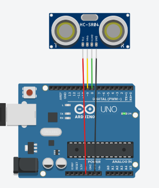
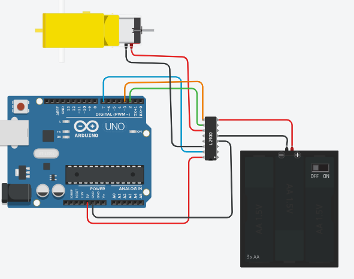
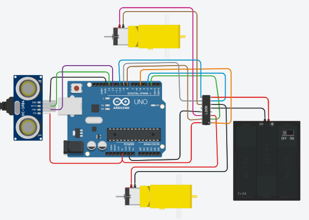

# 🚀 Basic Arduino UNO - SIKONEK

Repositori ini berisi materi dasar pemrograman **Arduino UNO** untuk pemula, mulai dari struktur program, kontrol LED, hingga penggunaan push button.

---

## 📌 1. Pengenalan Struktur Program Arduino

Setiap program Arduino memiliki dua fungsi utama:
- `setup()` → dijalankan sekali saat awal
- `loop()` → dijalankan berulang terus menerus

### 💻 Kode
```cpp
void setup() {
  Serial.begin(115200);
  Serial.println("Hello, SIIKONEK!");
}

void loop() {
  delay(10); // mempercepat simulasi
}
```

## 📏 2. Menggunakan Sensor Ultrasonik (HC-SR04)

Pada bagian ini, kita akan mengukur jarak menggunakan sensor ultrasonik HC-SR04. Sensor ini bekerja dengan mengirim gelombang suara dan mengukur waktu pantulannya.

---


### 🔌 Wiring
- VCC → 5V  
- GND → GND  
- TRIG → Pin 9  
- ECHO → Pin 8  

---

### 🧠 Penjelasan Singkat
- TRIG → mengirim sinyal ultrasonik  
- ECHO → menerima pantulan sinyal  
- `pulseIn()` → membaca durasi pantulan  
- Rumus jarak: durasi × 0.034 / 2
- 0.034 = kecepatan suara (cm/µs)

---

### 💻 Kode
```cpp
int TRIG = 9;
int ECHO = 8;

long durasi;
float jarak;

void setup() {
Serial.begin(9600);
pinMode(TRIG, OUTPUT);
pinMode(ECHO, INPUT);
}

void loop() {
// Kirim sinyal trigger
digitalWrite(TRIG, LOW);
delayMicroseconds(2);

digitalWrite(TRIG, HIGH);
delayMicroseconds(10);
digitalWrite(TRIG, LOW);

// Baca durasi pantulan
durasi = pulseIn(ECHO, HIGH);

// Hitung jarak (cm)
jarak = durasi * 0.034 / 2;

// Tampilkan ke Serial Monitor
Serial.print("Jarak: ");
Serial.print(jarak);
Serial.println(" cm");

delay(500);
}
```


## ⚙️ 3. Mengontrol Gearmotor DC dengan L293D

Pada bagian ini, kita akan mengontrol arah dan kecepatan motor DC menggunakan driver L293D. Motor akan bergerak maju, berhenti, lalu mundur secara bergantian.

---


### 🔌 Wiring
- Motor:
  - Positif → Output 1 L293D
  - Negatif → Output 2 L293D  

- Battery:
  - Baterai (+) → Power 2 L293D  
  - Baterai (–) → GND L293D  
  - 5V Arduino → Power 1 L293D  
  - GND Arduino → GND L293D  

- Arduino:
  - Pin 5 Arduino → Enable 1&2 (L293D)  
  - Pin 2 Arduino → Input 1 L293D  
  - Pin 7 Arduino → Input 2 L293D  

> ⚠️ Pastikan semua GND tersambung (Arduino + baterai + L293D)

---

### 🧠 Penjelasan Singkat
- L293D digunakan untuk mengontrol motor DC (arah & kecepatan)
- `Input 1` dan `Input 2` → menentukan arah putaran
- `Enable` → mengatur kecepatan (PWM)
- Kombinasi arah:
  - HIGH / LOW → maju  
  - LOW / HIGH → mundur  
  - LOW / LOW → berhenti  

---

### 💻 Kode
```cpp
int in1 = 2;
int in2 = 7;
int enA = 3;

void setup() {
  pinMode(in1, OUTPUT);
  pinMode(in2, OUTPUT);
  pinMode(enA, OUTPUT);
}

void loop() {
  // maju
  digitalWrite(in1, HIGH);
  digitalWrite(in2, LOW);
  analogWrite(enA, 200);
  delay(3000);

  // stop
  digitalWrite(in1, LOW);
  digitalWrite(in2, LOW);
  delay(2000);

  // mundur
  digitalWrite(in1, LOW);
  digitalWrite(in2, HIGH);
  analogWrite(enA, 200);
  delay(3000);

  // stop
  digitalWrite(in1, LOW);
  digitalWrite(in2, LOW);
  delay(2000);
}
```

## 🤖 4. Avoidance Robot (Robot Penghindar Halangan)

Pada bagian ini, kita menggabungkan sensor ultrasonik dan motor DC untuk membuat robot sederhana yang dapat menghindari halangan. Robot akan bergerak maju, dan berhenti jika mendeteksi objek di depan.

---


### 🔌 Wiring

#### ⚙️ Motor & L293D
- Motor 1:
  - Positif → Output 1 L293D
  - Negatif → Output 2 L293D  

- Motor 2:
  - Positif → Output 4 L293D
  - Negatif → Output 3 L293D  

- Baterai:
  - Baterai (+) → Power 2 L293D  
  - Baterai (–) → GND L293D  
  - 5V Arduino → Power 1 L293D  
  - GND Arduino → GND L293D  

- Arduino:
  - Pin 2 → Input 1  
  - Pin 3 → Input 2  
  - Pin 5 → Enable 1&2  

  - Pin 9 → Input 3  
  - Pin 8 → Input 4  
  - Pin 10 → Enable 3&4  

---

#### 📏 Sensor Ultrasonik
- VCC → 5V Arduino  
- GND → GND Arduino  
- TRIG → Pin 12  
- ECHO → Pin 13  

---

### 🧠 Penjelasan Singkat
- Sensor ultrasonik membaca jarak di depan robot
- Jika jarak < 100 cm → robot berhenti
- Jika jarak ≥ 100 cm → robot bergerak maju
- L293D digunakan untuk mengontrol arah dan kecepatan motor

---

### 💻 Kode
```cpp
int in1 = 2;
int in2 = 3;
int in3 = 8;
int in4 = 9;

int enA = 5;
int enB = 10;

int TRIG = 12;
int ECHO = 13;

long durasi;
float jarak;

void setup() {
  pinMode(in1, OUTPUT);
  pinMode(in2, OUTPUT);
  pinMode(in3, OUTPUT);
  pinMode(in4, OUTPUT);

  pinMode(enA, OUTPUT);
  pinMode(enB, OUTPUT);

  pinMode(TRIG, OUTPUT);
  pinMode(ECHO, INPUT);

  Serial.begin(9600);
}

void loop() {
  // ===== BACA SENSOR =====
  digitalWrite(TRIG, LOW);
  delayMicroseconds(2);

  digitalWrite(TRIG, HIGH);
  delayMicroseconds(10);
  digitalWrite(TRIG, LOW);

  durasi = pulseIn(ECHO, HIGH);
  jarak = durasi * 0.034 / 2;

  Serial.print("Jarak: ");
  Serial.println(jarak);

  // ===== LOGIKA =====
  if (jarak < 100) {
    // STOP
    digitalWrite(in1, LOW);
    digitalWrite(in2, LOW);
    digitalWrite(in3, LOW);
    digitalWrite(in4, LOW);

    analogWrite(enA, 0);
    analogWrite(enB, 0);

    Serial.println("STOP");
  } else {
    // MAJU
    digitalWrite(in1, HIGH);
    digitalWrite(in2, LOW);

    digitalWrite(in3, HIGH);
    digitalWrite(in4, LOW);

    analogWrite(enA, 200);
    analogWrite(enB, 200);

    Serial.println("MAJU");
  }

  delay(200);
}
```
